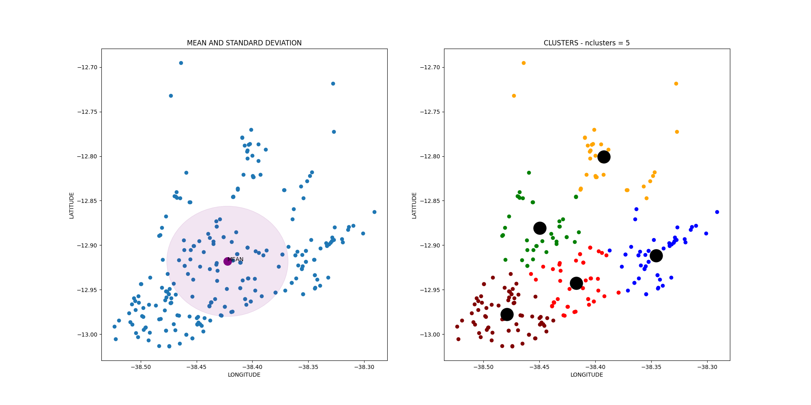
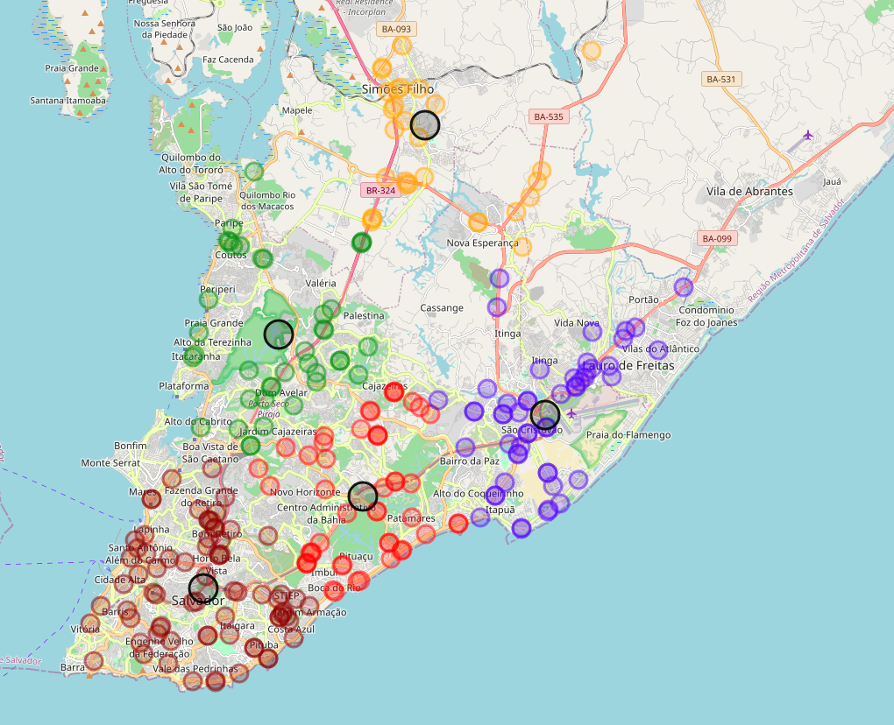

# pycluster-geo
Python-based Gegraphic Clusterization API

# Introduction

Pycluster is a free software API for automating keyword searches in 
Google's Places API and finding and displaying geographic cluster
information using the K-means clusterization technique. With Pycluster
API any user can search for specific keywords on Google Maps for a given
region and have the results saved into a .csv file. This file
can later be used for geographic clusterization using K-means.


# Repository Structure

* __jupyter/__    
        This folder stores example jupyter notebooks for data visualization.
* __doc/__
        Docs and tutorials.
* __pycluster/__
        Pycluster API module


# Example Clusterization

1. The following scripts execute a search for all gas stations around the [Lat,Long],
a point in Salvador-BA, with a 2km search readius. Outpout results are stored on a .csv file called 'outSSA.csv'. Examples of the .csv files returned by this search can be found in the 'jupyter/csv/ssa/' directory at this repository.

``` python
    #/usr/bin/python
    import pycluster
    coordinates = ['-12.980955, -38.482528'] # central coordinates in ssa
    keywords = ['gas+station', 'posto+gasolina']
    radius = '2000'
    api_key = '' # insert your Places API here
    outcsv = 'outSSA.csv'
    searchPlacesAPI(coordinates, keywords, radius, outcsv, api_key)
```

2. For data visualization both in PNG XY charts and HTML maps, use the 'kmeansSearchAndDisplay' function as showed bellow. Output files will be stored
inside the 'tmp/' directory passed as parameter.

``` python
    #/usr/bin/python
    import pycluster
    MAP_CENTER = [-12.970748228016372, -38.4761939536224] # display center for the map
    nclusters=5 # number of k-means clusters
    outdir="tmp/
    cityName="SalvadorCity"
    kmeansSearchAndDisplay(cityName, outdir+'outSSA.csv', nclusters, 
                            MAP_CENTER[0], MAP_CENTER[1], outdir=outdir)
```

### Example Results

- XY Charts:

 

- Maps:

 
